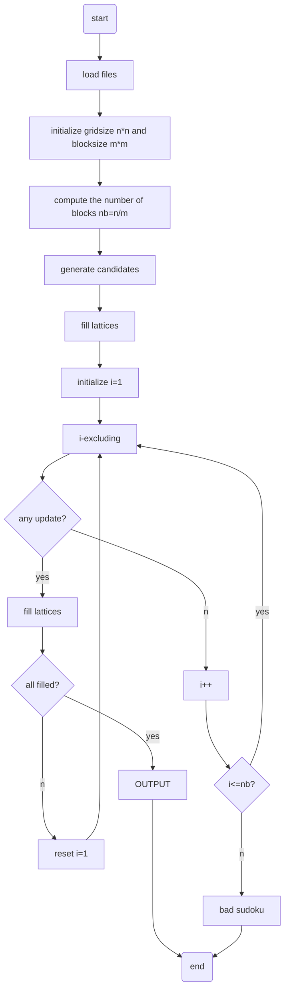

A project developed by Bin Qu to automatically solves Sudoku.

# Algorithm
## Main Structure

## Excluding

# Sudoku Game File Structure
## Example
```
grid_length = 9
block_length = 3
grid =
[
    7,9,2,0,0,5,4,0,0;
    0,0,8,0,2,0,0,6,0;
    0,5,4,3,9,8,0,0,0;
    2,0,5,7,0,0,0,0,3;
    8,0,3,1,0,0,5,0,0;
    1,7,0,5,3,4,8,2,6;
    0,3,0,9,0,1,0,8,0;
    0,8,7,0,0,0,0,0,0;
    0,0,0,0,4,6,3,0,0
]
```
note: '0' in grid matrix represents "empty".