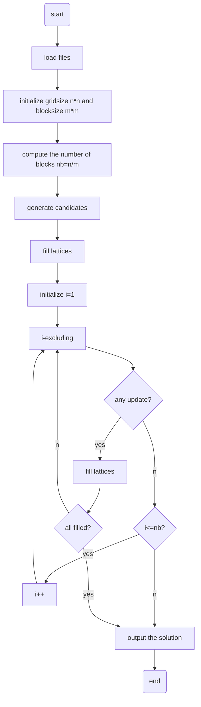

A project developed by Bin Qu to automatically solves Sudoku.

# Algorithm
## Main Structure

```mermaid
graph TD
    START("start")-->LOAD["load files"]
    LOAD-->INIT["initialize gridsize n*n and blocksize m*m"]
    INIT-->NOB["compute the number of blocks nb=n/m"]
    NOB-->GC["generate candidates"]
    GC-->FILL1["fill lattices"]
    FILL1-->INII["initialize i=1"]
    INII-->EXCLUDING["i-excluding"]
    EXCLUDING-->IF1{"any update?"}
    IF1--yes-->FILL2["fill lattices"]
    IF1--no-->BI{"i<=nb?"}
    BI--yes-->PLUSI["i++"]
    PLUSI-->EXCLUDING
    BI--no-->OUTPUT["output the solution"]
    FILL2-->ALF{all filled?}
    ALF--yes-->OUTPUT
    ALF--no-->EXCLUDING
    OUTPUT-->END("end")
```
## Excluding