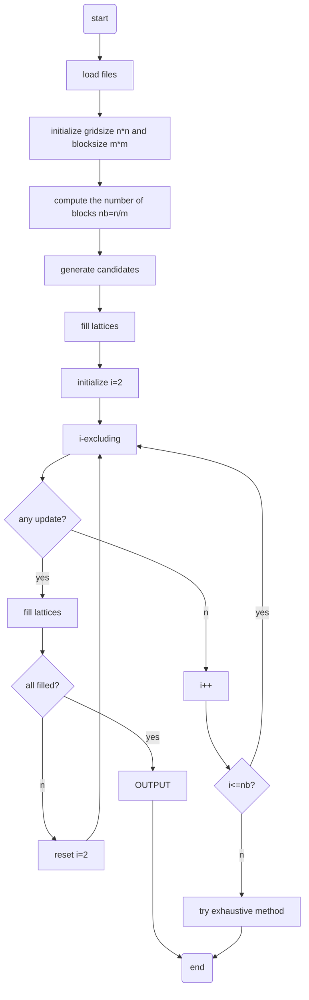
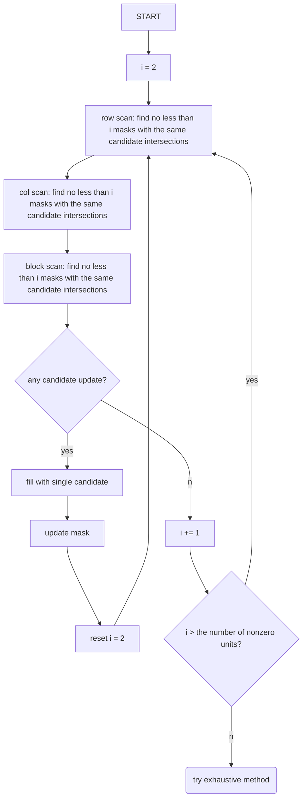
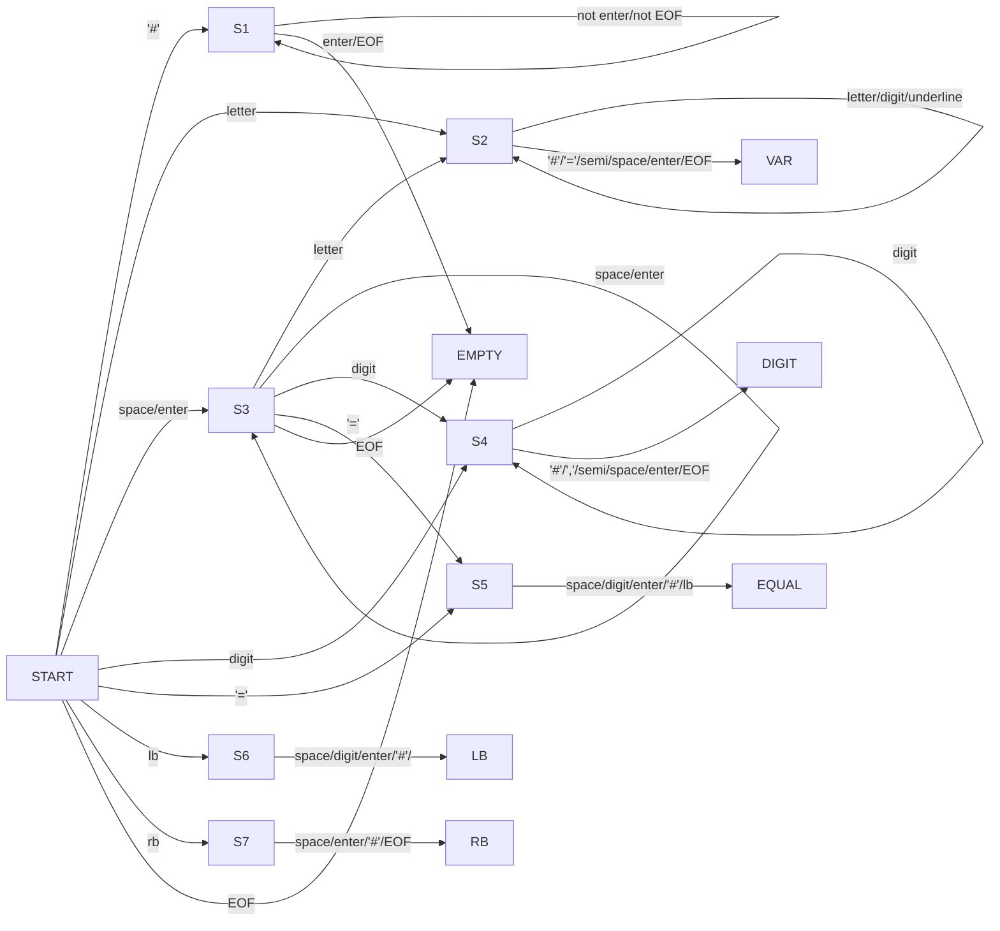
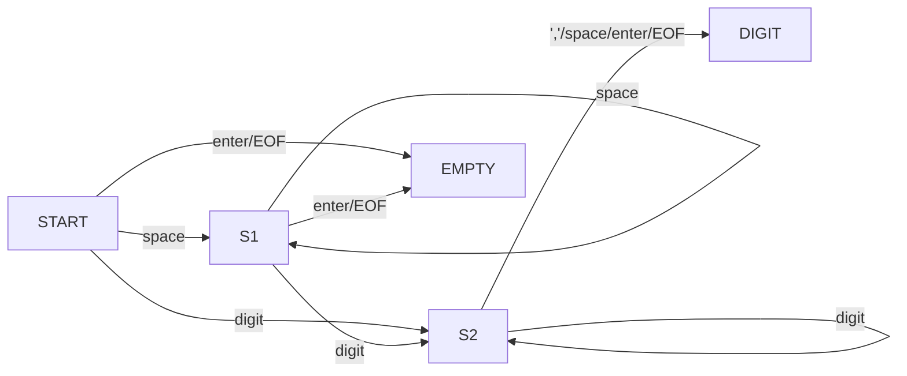

A project developed by Bin Qu to automatically solves Sudoku.

# Algorithm
## Main Structure

## Excluding


# Sudoku File Structure
## Example (Deprecated)
```
# no. 001 sudoku game
grid_length = 9
block_length = 3
grid =
[
    7,9,2,0,0,5,4,0,0;
    0,0,8,0,2,0,0,6,0;
    0,5,4,3,9,8,0,0,0;
    2,0,5,7,0,0,0,0,3;
    8,0,3,1,0,0,5,0,0;
    1,7,0,5,3,4,8,2,6;
    0,3,0,9,0,1,0,8,0;
    0,8,7,0,0,0,0,0,0;
    0,0,0,0,4,6,3,0,0
]
```
note: '0' in grid matrix represents "empty".
## FSM of Sudoku Script Language (Deprecated)

notes:
1. "LB" represents '[', and "RB" represents ']'.
2. "semi" represent ';'.
3. S2, S4, S5, S6, S7 collects char elements.

## Example of CSV Sudoku File
001.csv (difficulty = easy)
```
7,9,2,0,0,5,4,0,0
0,0,8,0,2,0,0,6,0
0,5,4,3,9,8,0,0,0
2,0,5,7,0,0,0,0,3
8,0,3,1,0,0,5,0,0
1,7,0,5,3,4,8,2,6
0,3,0,9,0,1,0,8,0
0,8,7,0,0,0,0,0,0
0,0,0,0,4,6,3,0,0
```
002.csv (difficulty = very hard)
```
6,0,0,3,0,0,0,9,0
0,0,4,8,0,0,0,0,0
0,1,0,0,7,0,0,0,4
0,2,0,0,0,0,6,0,1
8,0,0,7,0,0,0,0,0
0,0,0,0,6,0,0,0,9
0,9,0,0,0,1,0,0,0
1,0,0,0,0,6,9,0,0
3,0,0,0,4,0,0,8,0
```
003.csv (difficulty = easy)

note: '0' in csv file represents "empty".

## FSM of CSV File Reader
